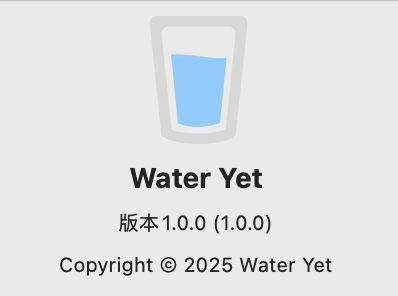
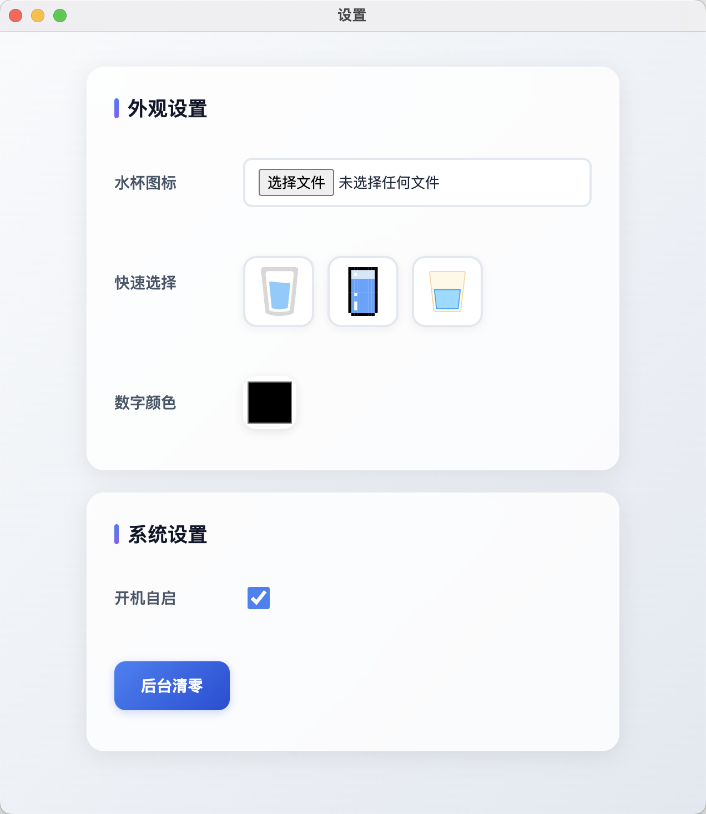

# WaterYet (macOS)

简单的喝水计数器，显示在桌面最上层：

- 左侧数字显示今天的喝水次数
- 点击卡通水杯让数字 +1
- 支持窗口拖拽

## 设置

- 在 macOS 顶部栏菜单中，点击 应用名 > 偏好设置…（或按 Cmd+,）
- 可上传本地图片更换水杯图标（支持 png/jpg/svg 等）或在“快速选择”中一键切换内置图标
- 可选择数字颜色
- 后台清零：点击按钮后，主窗口计数立即归零

## 使用示例

